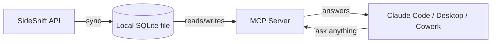

# SideShift Scanner


An open-source MCP server on top of [SideShift](https://sideshift.app)
UGC creator-program data. It syncs your creators, posts, and
performance history into a local file, then you just **talk to it**
through an AI coding agent — no dashboard, no UI to learn.



It's not trying to re-display what SideShift's own dashboard already
shows you — it answers things that dashboard doesn't: real format-trend
detection (from hashtags, not a guess), which creator actually fits a
new brief and why, and drafted content briefs in a creator's own style.

Not affiliated with or endorsed by SideShift. Full build spec:
[docs/build-spec.md](docs/build-spec.md).

## Setup

Four one-time steps, then everything else is just a chat message.

**1. Install**

```bash
git clone https://github.com/matthewhuang11/sideshift-scanner.git
cd sideshift-scanner
python3 -m venv .venv && source .venv/bin/activate && pip install -e .
```

**2. Add your API key** — copy the template and paste in your key
(SideShift dashboard → Settings → Integrations):

```bash
cp .env.example .env
```

**3. Point the agent at your Python** — copy the template and fill in
the absolute path to `.venv/bin/python` from step 1:

```bash
cp .mcp.json.example .mcp.json
```

**4. Restart Claude Code / Claude Desktop** in this folder so it picks
up the new MCP server.

That's it — no build step, no server to keep running.

## Just ask

```
Sync my latest SideShift data
What are my top performing creators?
What formats are trending right now?
Recommend a creator for a hook-question style unboxing video
```

The model calls the tools itself and answers in plain language. Sync
and analysis both happen as tool calls inside the conversation.

## MCP tools

| Tool | Purpose |
|---|---|
| `sync_data` | Pull latest data (`method='api'` for real SideShift, `'csv'` for sample data) |
| `list_creators` | Filter creators by niche / platform / status |
| `get_creator_profile` | Full profile: niche, style, platforms, performance history, best formats |
| `get_performance_summary` | Aggregate metrics + trend direction, scoped to creator/campaign/format/global |
| `top_performers` | Ranked list by a chosen metric |
| `detect_trending_formats` | Format/hook clusters outperforming the roster baseline |
| `recommend_creators_for_brief` | Ranked creators for a brief/format, with rationale |
| `generate_content_brief` | Draft a brief in a creator's own style, targeting a given or trending format |

<details>
<summary><strong>Prefer the CLI, or want auto-sync? (no agent required)</strong></summary>

```bash
python -m ugc_analytics.cli sync --method api
python -m ugc_analytics.cli top-performers --metric views -n 5
```

To sync on a schedule instead of on request, a cron job calling the
same command works well:

```
0 8 * * * cd /path/to/sideshift-scanner && .venv/bin/python -m ugc_analytics.cli sync --method api >> data/sync.log 2>&1
```

</details>

<details>
<summary><strong>Project layout</strong></summary>

```
src/ugc_analytics/
  db.py              SQLite schema + connection helpers
  models.py           dataclasses for the internal schema
  ingestion/
    base.py            IngestionAdapter interface + SyncResult
    csv_adapter.py      reads creators.csv / content_items.csv / performance_metrics.csv
    api_adapter.py       real SideShift API adapter (GET /creators, /programs, /posts, /posts/{id}/metrics-history)
  analysis/
    profiling.py         creator niche/style tagging
    performance.py        aggregation + roster-baseline comparisons
    trends.py              format/hook clustering vs. baseline
    matching.py             creator-for-brief scoring
    briefs.py                generate_content_brief drafting
  server.py            MCP server wiring the tools above
  cli.py               local CLI fallback (sync, list-creators, top-performers, ...)
sample_data/            example CSVs matching the ingestion adapter's expected shape
tests/                 unit tests for db, ingestion, and analysis (pytest, `pip install -e ".[dev]"`)
```

</details>

<details>
<summary><strong>SideShift API notes</strong></summary>

SideShift publishes a public, API-key-authenticated REST API — docs at
[app.sideshift.app/docs](https://app.sideshift.app/docs), no login
required to view them, OpenAPI spec at
`app.sideshift.app/openapi/sideshift-api-public.yaml`.

A few things the published docs get wrong that `api_adapter.py` corrects
for on real accounts: timestamps are Unix seconds, not milliseconds;
a post's creator/program links are top-level fields, not nested;
`/posts/{id}/metrics-history` wraps its payload in a `data` key. SideShift
also attributes some posts to "ghost handles" or removed creators that
`/creators` excludes by design — that content is still ingested (no
foreign-key requirement on it) and `top_performers`'s `include_unlisted`
param toggles whether it's shown.

`earnings` on each post is ingested as `revenue`, but it's a running
total, not a per-day breakdown, and reads null on accounts where no
payouts have run yet.

</details>

<details>
<summary><strong>Open questions / not built yet</strong></summary>

- Roster-only, or also profiling applicants who haven't posted yet?
- Single-user (local SQLite) or shared/hosted (Postgres)?
- Real content-style classification from captions/titles beyond hashtag
  extraction (e.g. an LLM tagging pass for tone/hook style).

</details>

## Contributing

Issues and PRs welcome — in particular, someone with real SideShift
dashboard access smoke-testing `ingestion/api_adapter.py` against a live
API key (it's currently verified against fixture responses shaped like
the published OpenAPI spec, not a live account).

## License

[MIT](LICENSE)
